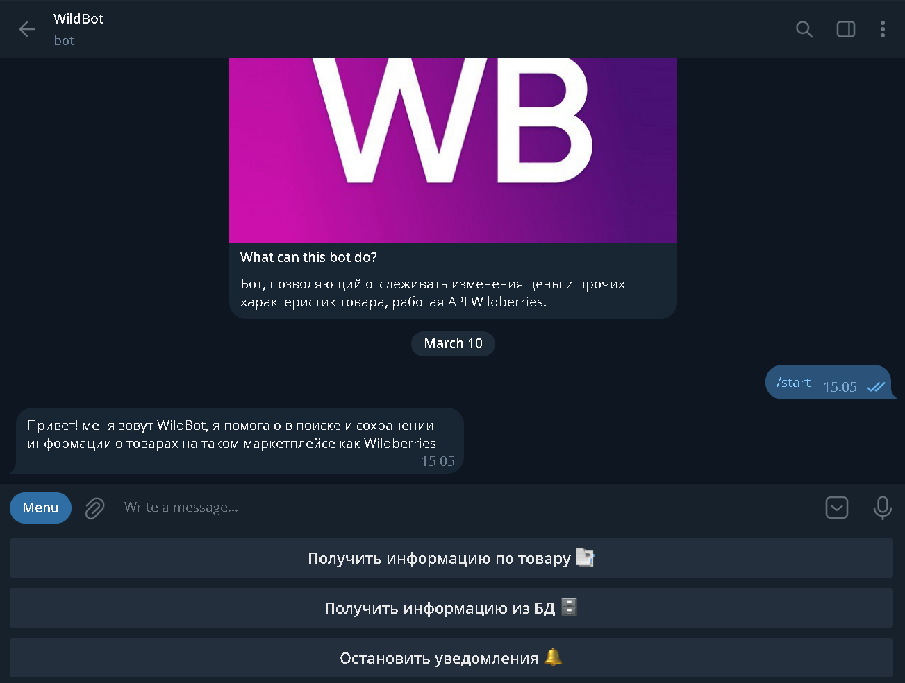
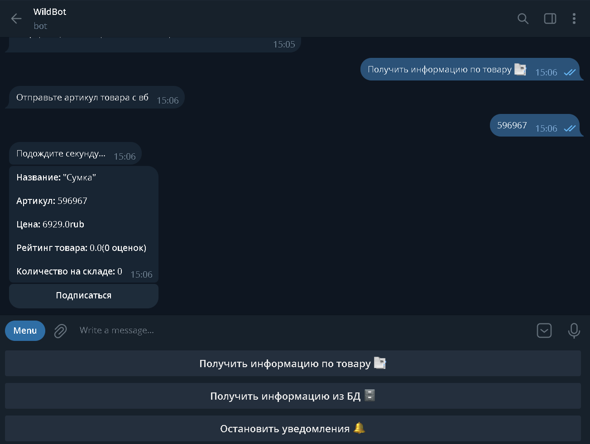
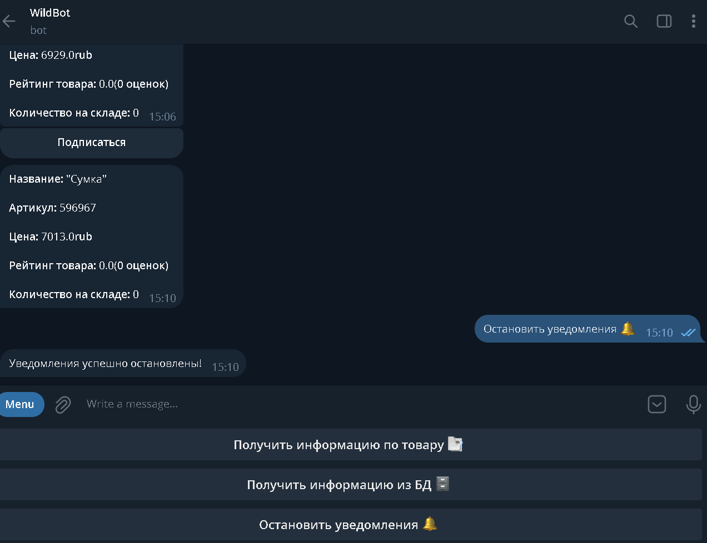
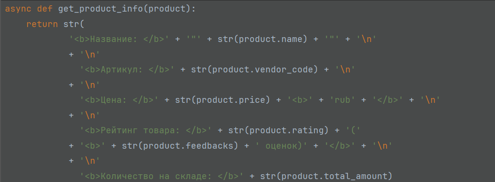
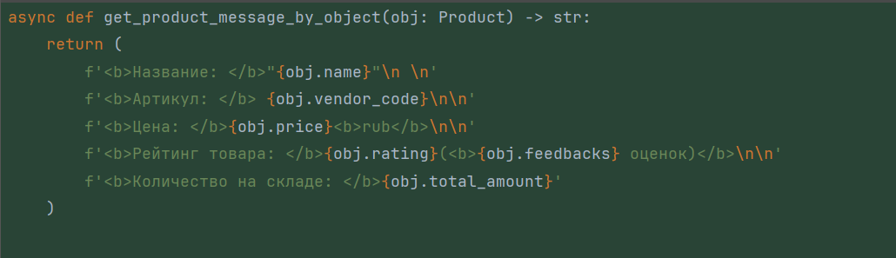
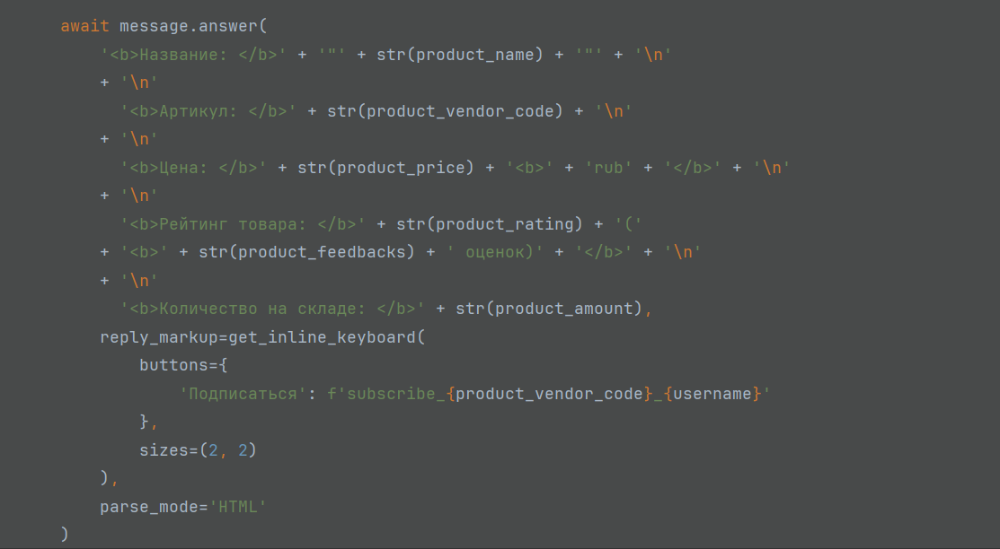
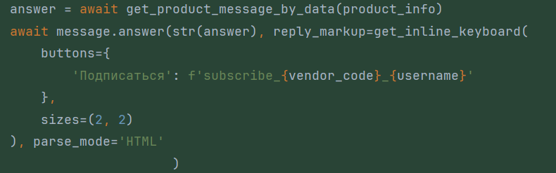
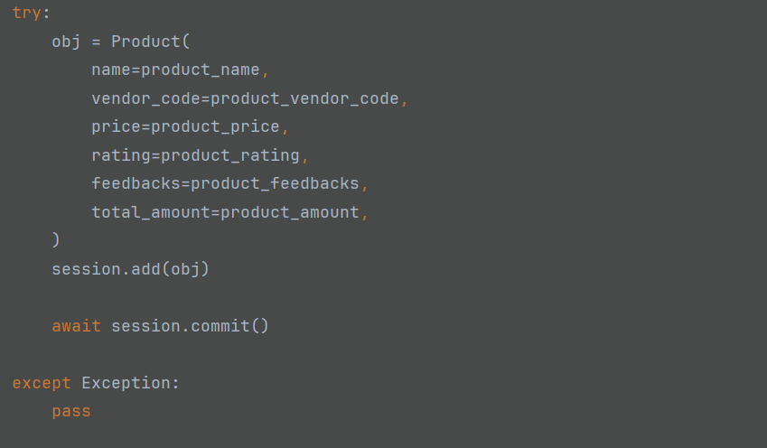
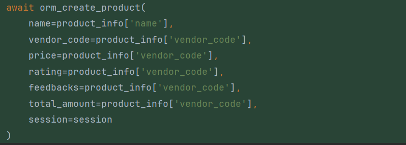
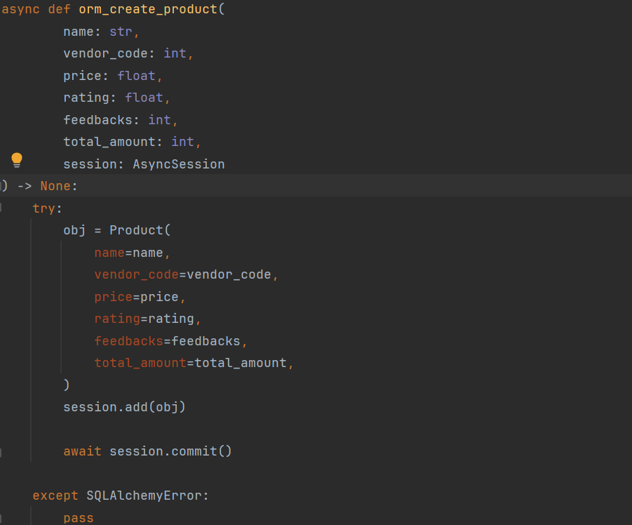

<h1>Code refactor</h1>

<h2>Замена оператора "+", f-строками</h2>

<h2>До</h2>

<h2>После</h2>

<h2>Перенос кода в отдельную функцию get_product_info_by_object</h2>

<h2>До</h2>

<h2>После</h2>

<h2>Уточнение типа исключения SQLAlchemyError, в блоках try и except</h2>

<h2>До</h2>

<h2>После</h2>

